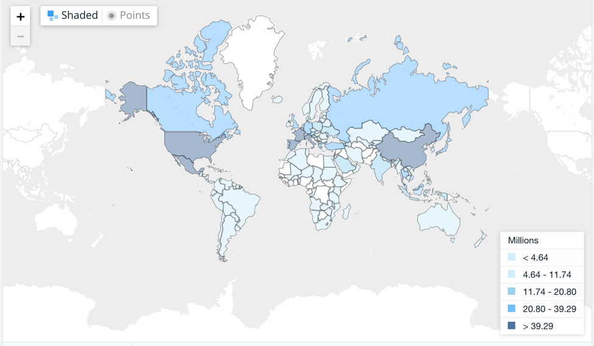
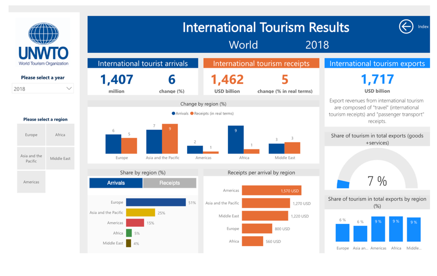

# Project 2: International Traveler Arrival Data Visualization Dashboard

## Group Members and Responsibilities

1. Solicia Xu - D3 visualizations, interactive YoY dashboard, Flask, HTML
2. Ben Bastedo - SQL Database set up, Flask, Bootstrap, HTML, MapBox, Documentation, AOS
3. Luis Casas - Flask, Bootstrap, HTML, MapBox, Documentation

## Required Components to Run Dashboard

1. [Python](https://www.python.org/downloads/)
2. [JavaScript](https://www.javascript.com/)
3. [Plotly](https://plot.ly/)
4. [PostGres SQL](https://www.postgresql.org/)
5. [SQLAchemy](https://docs.sqlalchemy.org/en/13/)
6. [Flask](https://www.fullstackpython.com/flask.html)
7. [MapBox](https://www.mapbox.com/)
8. [NPM](https://www.npmjs.com/)
9. [AnimateOnScroll](https://github.com/michalsnik/aos#animations)

## Instructions to Run Dashboard

1. Clone repo to local machine and save file path. You will need this for step 2.
2. Open the terminal and change directory to where you saved the files above in step 1.
3. Run 'python app.py' from the root directory you cloned. This will start your Flask application, which allows us to run different web pages and routes.
4. Open your web browser and type in [Localhost:5000](Localhost:5000) in the URL. Hit Enter. From here on out, we will now refer to this page as the 'homepage'.
5. The homepage displays international arrival information by country. Select a country from the drop down menu. This will display location on the world map, as well as # of arrivals and total GDP by year.
6. To look through data by year, direct your browser to [Localhost:5000/latlngs](Localhost:5000/latlngs). This will show each countries arrival and GDP information by year.

## Initial Questions to Ask

1. Based on the travel information, we want to visualize where people are traveling most frequently on both a micro (yearly) and macro level (overall)?
2. How do arrivals in countries with higher GDPs affect number of passengers incoming?
3. Are all countries travel data accurately displayed from our datasets? What could cause some discrepancies?

## Data Set Chosen For Visualization

[International Arrival Data](https://data.worldbank.org/indicator/ST.INT.ARVL?view=map)

### Cleaned Datasets Used for API Creation

[Cleaned Arrival Data](static/cleaned_data/ArrivalCleaned.csv)

[Cleaned GDP Data](static/cleaned_data/Clean_InterGDP.csv)

## Dashboards We Drew Inspiration From

## Future Considerations

1. AnimateOnScroll needs modification. Currently, in order to animate when scrolling, the window must be resized to activate the animations. Ideally, we would like to work this better.
2. Add a new plot that shows top 5 growing international arrivals year over year.
3. Transversely, add a plot that shows the bottom 5 in terms of declining arrivals.
4. Find correlation between total country GDP and number of international arrivals. See if there is correlation between GDP and arrival number.
5. Create heatmap visualization to better understand depth of arrival data.
6. Increase Bootstrap and HTML layouts.
7. Host data on cloud database to make this a deployable app.

## Limitations

1. Some libraries were limited by functionality. As such, further research into more complete libraries would offer greater chance at success.
2. Manipulate the year over year plots to show more visual data.
3. Research MapBox implementation to increase optional inputs provided for plots.
4. Some countries did not have accurate data (Afghanistan) as they do not release international traveler data. See if there is dataset that has complete information.
5. Given more time, could a flight arrival correlations between countries be found?