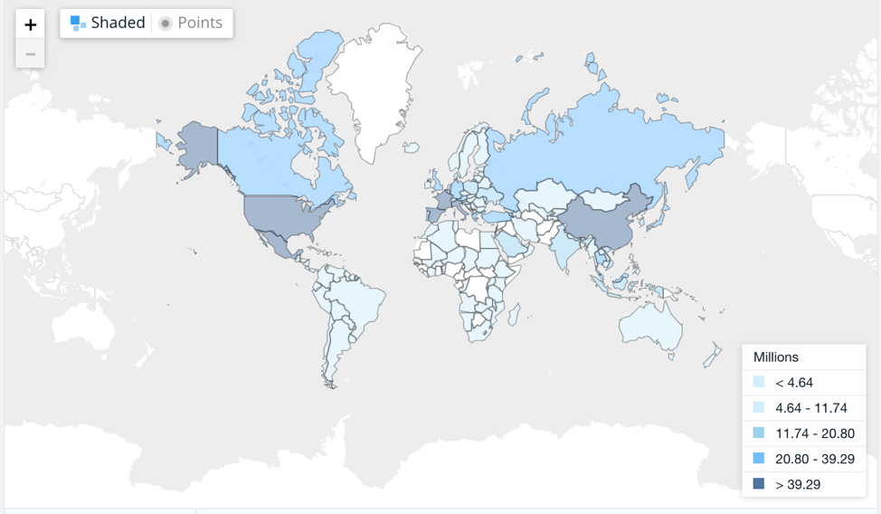
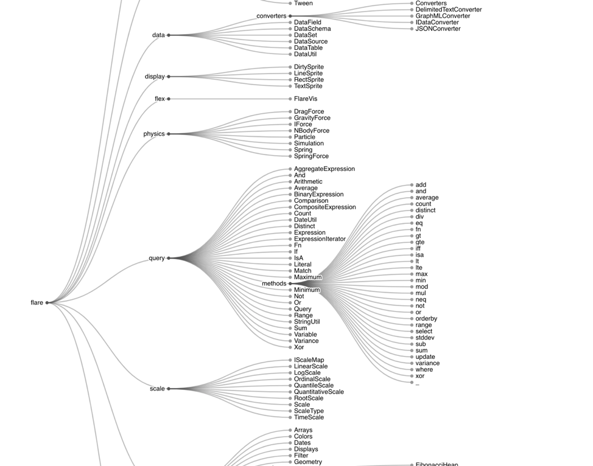
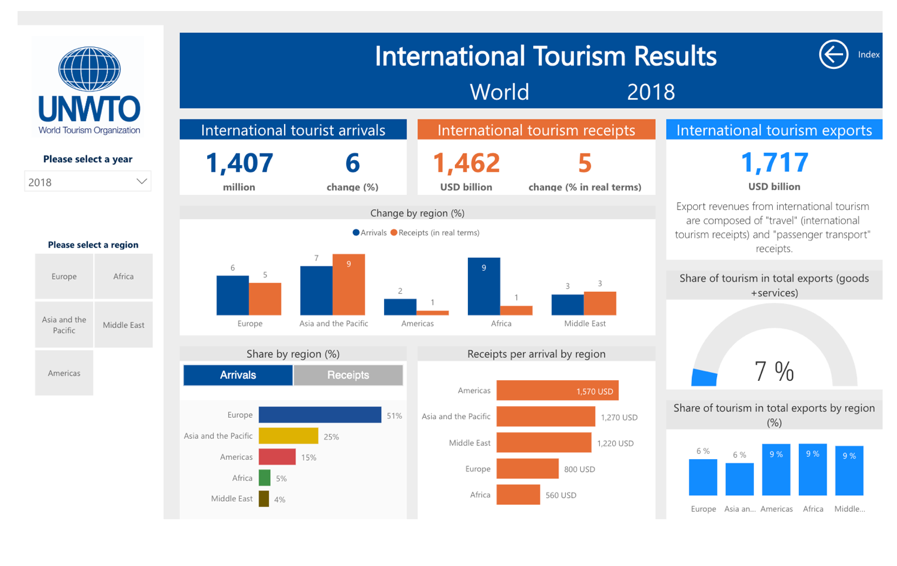

# Project-2 Travel information per yearly basis 

## Solicia, Ben, Luis C

Based on the travel information, we want to visualize where people are going as their travel destinations. How is the destination related to their income level? Where are the most visited countries for US travelers based on flight info?

### Data Set:

https://ourworldindata.org/tourism

https://knoema.com/atlas/topics/Tourism/datasets

https://www.statista.com/markets/420/travel-tourism-hospitality/

https://data.world/datasets/travel

https://data.worldbank.org/indicator/ST.INT.ARVL?view=map

https://catalog.data.gov/dataset/country-travel-information

### Inspiring visualizations:

